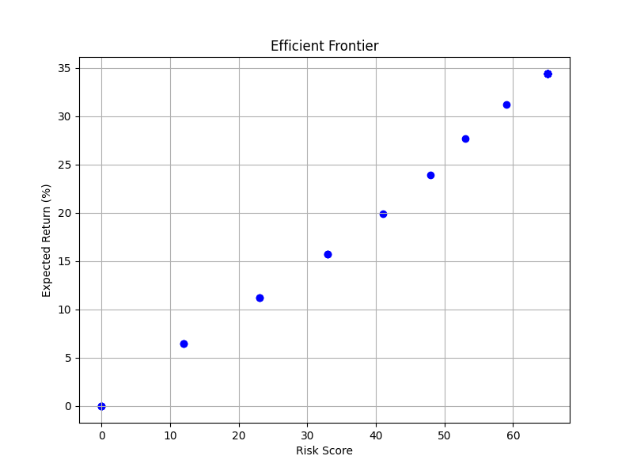

# 💼 Portfolio Optimizer (0/1 Knapsack)

A command-line tool to optimize investment portfolios using the **0/1 Knapsack algorithm** with optional risk filtering and visualizing the efficient frontier. Built with Python, Pandas, and Matplotlib.



---

## 📌 Features

* ✅ Dynamic programming-based 0/1 knapsack for portfolio selection
* 📉 Risk filtering using score thresholds
* 📊 Efficient frontier plot (Risk vs Return)
* 🧪 Unit testing to validate optimizer behavior
* 💬 Command-line interface for ease of use

---

## 📁 Project Structure

```plaintext
Portfolio_Optimizer_Project/
│
├── assets.csv              # Input data: Ticker, Return, Risk, Price
├── optimizer.py            # Main logic: DP, risk filter, CLI
├── test_optimizer.py       # Unit tests using unittest
├── frontier.png            # Saved plot of efficient frontier
├── requirements.txt        # Dependencies
└── README.md               # Project documentation
```

---

## 📂 Input Data Format

### `assets.csv`

| Ticker | ExpectedReturn(%) | RiskScore(0-100) | Price |
| ------ | ----------------- | ---------------- | ----- |
| INFY   | 14.5              | 20               | 1234  |

> You may also use `prices.csv` (optional) if you want to calculate expected returns and risk from raw historical data.

---

## 🔧 Installation

First, clone the repository and install the required packages:

```bash
git clone https://github.com/LAKSHYAMARODIA01/Portfolio-Optimizer-Project
cd Portfolio_Optimizer_Project
pip install -r requirements.txt
```

### 📦 `requirements.txt` includes:

```txt
pandas
matplotlib
```

---

## ▶️ Usage

Run the optimizer with your inputs:

```bash
python optimizer.py --capital 75000 --risk 35 --csv assets.csv --plot
```

### 🔄 Arguments

| Argument    | Description                              | Example            |
| ----------- | ---------------------------------------- | ------------------ |
| `--capital` | Total investment capital (int)           | `--capital 75000`  |
| `--risk`    | Risk tolerance score (0–100)             | `--risk 35`        |
| `--csv`     | CSV file of assets                       | `--csv assets.csv` |
| `--plot`    | Flag to generate efficient frontier plot | `--plot`           |

---

## 🧠 Algorithm Explanation

### 🔢 0/1 Knapsack via Dynamic Programming

* Maximize total expected return without exceeding budget.
* DP table: `dp[n+1][capital+1]`
* Time complexity: `O(n × capital)`

### ⚖️ Risk Filtering (Greedy)

* If total risk exceeds threshold:

  * Iteratively remove the **lowest-return** asset until within the limit.

### 📈 Efficient Frontier

* Runs multiple times (risk from 0 to 100 in steps of 5).
* Plots return vs risk to visualize optimal trade-offs.

---

## ✅ Unit Testing

Test the functionality with:

```bash
python test_optimizer.py
```

Tests include:

* 📈 Asset selection optimization
* ❌ Risk threshold filtering
* 💰 Cost and return accuracy

---

## 🚀 Future Improvements

* 🧮 Add support for fractional (continuous) knapsack
* 📊 Interactive plots (Plotly or Dash)
* 💾 Use live market APIs for real-time data
* 🌐 Build a web-based UI using Flask or Django

---

## 👨‍💻 Author

**Lakshya Marodia**
📧 [LinkedIn](https://www.linkedin.com/in/lakshya-marodia)


